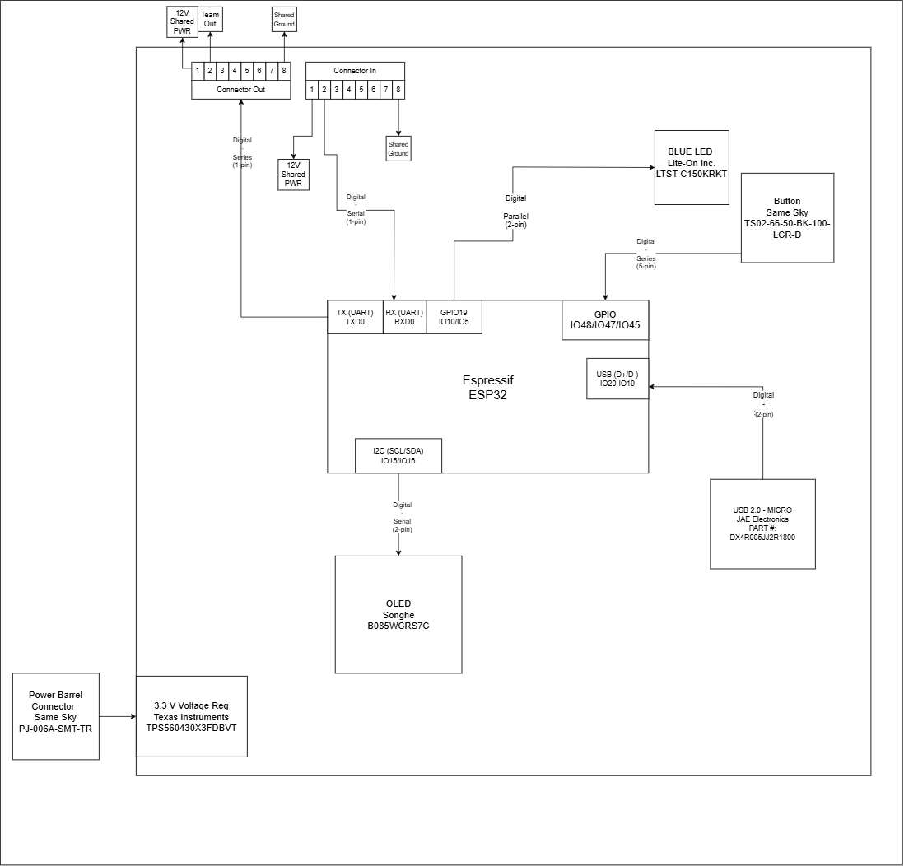

## Overview
The purpose of this block diagram is to showcase the components need to achieve the HMI portion of the team project. With that, there is the needed power source coming from a power adapter which is regulated by a voltage regulator, ensuring the board only recieves 3.3V. Furthermore, there is an LED as a test point for the project and push buttons which are digital inputs from the users to communicate on what they want to see from the OLED Screen. The OLED itself uses I2C communications which is why it is wired through GPIO15 and GPIO16. There is also a USB-B connector that is needed which is why it is connected into both GPIO19 and GPIO20 as on the datasheet those two GPIO's are the only ones who directly connect to the USB communicator.

## Individual Block Diagram 

