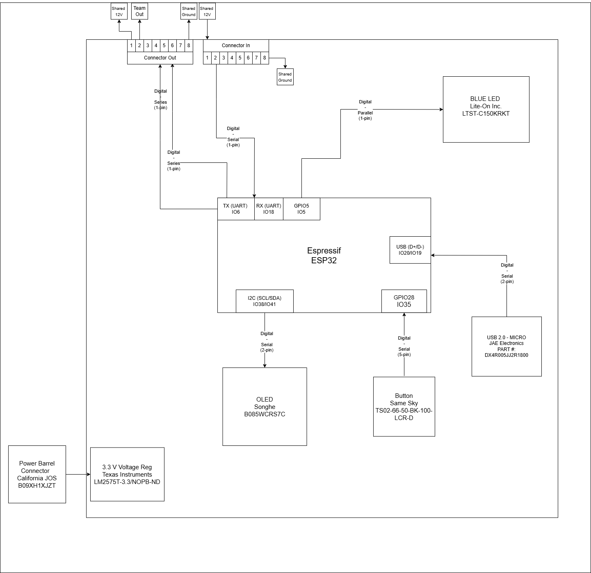

## Overview
The purpose of this block diagram is to showcase the components need to achieve the HMI portion of the team project. With that, there is the needed power source coming from a power adapter which is regulated by a voltage regulator, ensuring the board only recieves 3.3V. Furthermore, there is an LED(IO5) as a test point for the project and push buttons which are digital inputs from the users to communicate on what they want to see from the OLED Screen. 

The OLED itself uses I2C communications which is why it is wired through IO38(SCL) and IO41(SDA). There is also a USB-B to Micro USB connector that is needed which is why it is connected into both GPIO19(IO13) and GPIO20(IO14) as on the datasheet those two GPIO's are the only ones who directly connect to the USB communicator.

## Individual Block Diagram 

*Link to the Individual Block Diagram: [draw.io](https://app.diagrams.net/?src=about#G1uLQSxSL_KaxljhqqRA7aLpq8QaTXRsPE#%7B%22pageId%22%3A%22frxZK7z-iqkThGcEDT0R%22%7D)*

*PDF of the Individual Block Diagram: [PDF of I.B.D.](FINAL_307i.pdf)*

## Summary 
With this Individual Block Diagram, this showcases the pinout needed to achieve the goal of having both an OLED and HMI Module for Team 307's system. The 8-pinout headers allows wired communication between boards with both shared power/ground and a UART system(RX/TX). Additionally, there is individual power coming from outside power which goes through a power regulator for a 3.3V which is needed for the PCB. Furthermore, this block diagram shows the needed components to ensure functionality: ESP32, OLED, LED and Push buttons.
