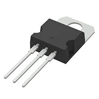
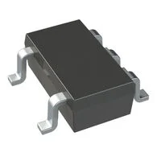
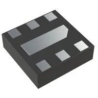

## Module's Selected Major Components

This page outlines the main components selected for the Human Machine Interface (HMI) module. The list includes power sources (barrel jacks), power regulators and OLEDs. These three are the main focuses of this page as the resistors, compacitors, leds, and headers are provided from the course. 

## Power Source

### Choice 1:

| **Pros** | **Cons** |
| ----------------- | ----------------- |
|  |  | 
|  |  | 
|  |  |
|  |  | 
### Choice 2:

| **Pros** | **Cons** |
| ----------------- | ----------------- |
|  |  | 
|  |  | 
|  |  |
|  |  | 

### Choice 3:

| **Pros** | **Cons** |
| ----------------- | ----------------- |
|  |  | 
|  |  | 
|  |  |
|  |  | 

## Power Regulator

### Choice 1: Linear 3.3V Voltage Regulator

* **Price:** $0.41/each
* **Product Link:** [L7809CV](https://www.digikey.com/en/products/detail/umw/L7809CV/24889965?gclsrc=aw.ds&gad_source=1&gad_campaignid=21136823955&gbraid=0AAAAADrbLli0bIFVhRCsyialuzG6uLAUV&gclid=Cj0KCQiAk6rNBhCxARIsAN5mQLvVgdvWiP_iBn4oW_0oh67-wxJjyq7hfaxu65XctnEDpUbIFSJuw18aAkpmEALw_wcB)

| **Pros** | **Cons** |
| ----------------- | ----------------- |
| Very simple to use | A through-hole which we cannot use| 
| Linear | Only 3 prongs which doesn't have the stuff required for the project | 
| --- | DC-DC Conversion |

### Choice 2: Switching Regulator IC Positive Fixed 3.3V 

* **Price:** $0.22/each
* **Product Link:** [AP2112K-3.3TRG1](https://www.digikey.com/en/products/detail/diodes-incorporated/AP2112K-3-3TRG1/4470746)

| **Pros** | **Cons** |
| ----------------- | ----------------- |
| Better Performance | Generates heat at high Voltage  | 
| Cheap to order  | has a 600MA limit | 
| Can solder easily on board | --- |

### Choice 3: SMD 3.3V Power Regulator

* **Price:** $0.25/each
* **Product Link:** [MIC5528-3.3YMT-TR](https://www.digikey.com/en/products/detail/microchip-technology/MIC5528-3-3YMT-TR/4864020)

| **Pros** | **Cons** |
| ----------------- | ----------------- |
| Has protection for over current/temperature | Out of the three options, it is slightly expensive | 
| Can handle -40°C ~ 125°C | Can be difficult to install | 
| Saves space on the PCB Board | --- |

### Selected Component

The selected component for this project is the second option: Switching Regulator IC Positive Fixed 3.3V. The reason why is because it has all the pinouts that are required for the main project and is inexpensive to order multiple for different scenerios. Furthermore, it would easier to implement in the PCB design and when soldering in-person.

## OLED Screen

### Choice 1:

| **Pros** | **Cons** |
| ----------------- | ----------------- |
|  |  | 
|  |  | 
|  |  |
|  |  | 

### Choice 2:

| **Pros** | **Cons** |
| ----------------- | ----------------- |
|  |  | 
|  |  | 
|  |  |
|  |  | 

### Choice 3:

| **Pros** | **Cons** |
| ----------------- | ----------------- |
|  |  | 
|  |  | 
|  |  |
|  |  | 

### Selected Components:
