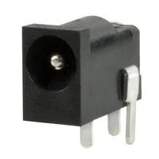
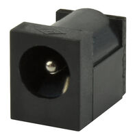
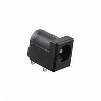
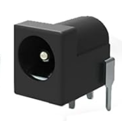
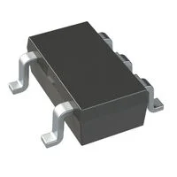
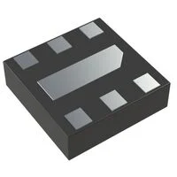
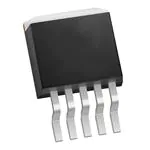
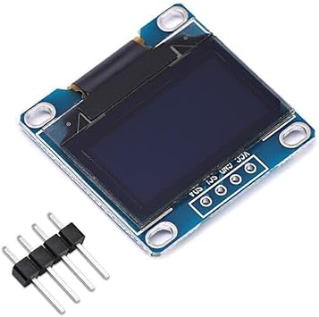
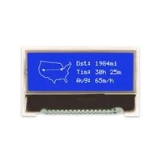
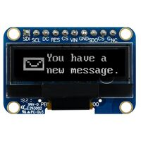

## Module's Selected Major Components

This page outlines the main components selected for the Human Machine Interface (HMI) module. The list includes power sources (barrel jacks), power regulators and OLEDs. These three are the main focuses of this page as the resistors, compacitors, leds, and headers are provided from the course. 

## Power Source

### Choice 1: CONN PWR JACK 1.35X3.5MM SOLDER

* **Price:** $0.67/each
* **Product Link:** [Pj-007](https://www.digikey.com/en/products/detail/same-sky-formerly-cui-devices-/PJ-007/263523?gclsrc=aw.ds&gad_source=1&gad_campaignid=17336967819&gbraid=0AAAAADrbLlgs4hw9LztVYDF5uuUEHngrn&gclid=Cj0KCQiAk6rNBhCxARIsAN5mQLsoOYExZJqYb1FyfbmE2W-5naa-h_G_fIaPOKq9fLMpaS6GJ0RPOZUaAtrQEALw_wcB)

| **Pros** | **Cons** |
| ----------------- | ----------------- |
| Inexpensive compared to others | Needs correct orientation | 
| Easy to install | polarity needs to correct | 
| Already given CAD Model | -- |

### Choice 2: Power Barrel Connector Jack 2.10mm ID (0.083"), 5.50mm OD (0.217") Surface Mount

* **Price:** $0.91/each
* **Product Link:** [PJ-006A-SMT-TR](https://www.digikey.com/en/products/detail/same-sky-formerly-cui-devices/PJ-006A-SMT-TR/408456)

| **Pros** | **Cons** |
| ----------------- | ----------------- |
| Can handle temperature when soldering | Expensive | 
| Is a Surface Mount | Harder to place in PCB design | 
| Has 5,000 cycles of life| --- |

### Choice 3: CONN PWR JACK 2X5.5MM SOLDER

* **Price:** $0.69/each
* **Product Link:** [KLDX-0202-A](https://www.digikey.com/en/products/detail/kycon-inc/KLDX-0202-A/9975992)

| **Pros** | **Cons** |
| ----------------- | ----------------- |
| A TH component | Orientation is different from classic | 
| Detailed Datasheet | Different CAD Model | 
| Operating Temperature: -25˚C to +85˚C | --- |

### Choice 4: California JOS Barrel Jack

* **Price:** $8.99/10
* **Product Link:** [California JOS](https://www.amazon.com/California-JOS-Breadboard-Friendly-Mounting-Female/dp/B09XH1XJZT/ref=sxin_18_pa_sp_search_thematic_sspa?content-id=amzn1.sym.3a6fbbbd-497f-4963-9773-14d8cc6a4e5a%3Aamzn1.sym.3a6fbbbd-497f-4963-9773-14d8cc6a4e5a&cv_ct_cx=dc%2Bpower%2Bjack&keywords=dc%2Bpower%2Bjack&pd_rd_i=B09XH1XJZT&pd_rd_r=b8d70ee1-4108-42bb-bc51-9129a5f0ea59&pd_rd_w=Pcfna&pd_rd_wg=VKUDj&pf_rd_p=3a6fbbbd-497f-4963-9773-14d8cc6a4e5a&pf_rd_r=R403WSAFK9JVM6ZRQW5M&qid=1777933046&sbo=RZvfv%2F%2FHxDF%2BO5021pAnSA%3D%3D&sr=1-1-383bc08e-f3b5-4928-b079-a9607486ab19-spons&aref=jfoH8SsxW8&sp_csd=d2lkZ2V0TmFtZT1zcF9zZWFyY2hfdGhlbWF0aWM&th=1)

| **Pros** | **Cons** |
| ----------------- | ----------------- |
| A TH component | No detailed Datasheet  | 
| Familiar Part | --- | 
| Bulk cost is affordable | --- |  

### Selected Component

The component selected for the power source is option 4: California JOS Barrel Jack. The main reason is the pricing being significantly cheaper if ordered in bulk as this is a critical piece for the PCB. 

## Power Regulator

### Choice 1: Linear 3.3V Voltage Regulator

* **Price:** $0.41/each
* **Product Link:** [L7809CV](https://www.digikey.com/en/products/detail/umw/L7809CV/24889965?gclsrc=aw.ds&gad_source=1&gad_campaignid=21136823955&gbraid=0AAAAADrbLli0bIFVhRCsyialuzG6uLAUV&gclid=Cj0KCQiAk6rNBhCxARIsAN5mQLvVgdvWiP_iBn4oW_0oh67-wxJjyq7hfaxu65XctnEDpUbIFSJuw18aAkpmEALw_wcB)

| **Pros** | **Cons** |
| ----------------- | ----------------- |
| Very simple to use | A through-hole which we cannot use| 
| Linear | Only 3 prongs which doesn't have the stuff required for the project | 
| --- | DC-DC Conversion |

### Choice 2: Switching Regulator IC Positive Fixed 3.3V 

* **Price:** $0.22/each
* **Product Link:** [AP2112K-3.3TRG1](https://www.digikey.com/en/products/detail/diodes-incorporated/AP2112K-3-3TRG1/4470746)

| **Pros** | **Cons** |
| ----------------- | ----------------- |
| Better Performance | Generates heat at high Voltage  | 
| Cheap to order  | has a 600MA limit | 
| Can solder easily on board | --- |

### Choice 3: SMD 3.3V Power Regulator

* **Price:** $0.25/each
* **Product Link:** [MIC5528-3.3YMT-TR](https://www.digikey.com/en/products/detail/microchip-technology/MIC5528-3-3YMT-TR/4864020)

| **Pros** | **Cons** |
| ----------------- | ----------------- |
| Has protection for over current/temperature | Out of the three options, it is slightly expensive | 
| Can handle -40°C ~ 125°C | Can be difficult to install | 
| Saves space on the PCB Board | --- |

### Option 4: Switching Regulator IC Positive Fixed 3.3V 1 Output 1A TO-220-5

* **Price:** $2.23/each
* **Product Link:** [LM2575D2T-3.3R4G](https://www.digikey.com/en/products/detail/onsemi/LM2575D2T-3-3R4G/1476688?s=N4IgTCBcDaIDIFkwFYDsyAiYAqBaAzAHT4BKALAOIgC6AvkA)

| **Pros** | **Cons** |
| ----------------- | ----------------- |
| Given in Class| Out of the 4 options, it is expensive | 
| Has a detailed datasheet | Need Flux paste for easy installation | 
| Easy to install/uninstall | Need hot gun to uninstall|

### Selected Component

The selected component for this project is Option 4: Switching Regulator IC Positive Fixed 3.3V 1 Output 1A TO-220-5. This component was given by the professor which made research and installation easier as there was enough time given to learn about it. Not only that, the spacing between the prongs made it easy to solder in even if there wasn't Flux paste available.

## OLED Screen

### Choice 1: OLED LCD Display Board Module

* **Price:** Unknown
* **Product Link:** [OLED Screen](https://www.amazon.com/Songhe-0-96-inch-I2C-Raspberry/dp/B085WCRS7C/)

| **Pros** | **Cons** |
| ----------------- | ----------------- |
| Familiar as it was a lab | Currently unavalible to order | 
| pinouts are simple | Screen is small | 
| Clear display | Very coding heavy |

### Choice 2: GRAPHIC DISPLAY STN WHITE (BLUE)

* **Price:** $10.95/each
* **Product Link:** [Graphic Display](https://www.digikey.com/en/products/detail/newhaven-display-intl/NHD-C12832A1Z-NSW-BBW-3V3/2059235)
  
| **Pros** | **Cons** |
| ----------------- | ----------------- |
| Has a blue screen | Expensive | 
| Multiple functions | Has multiple pins that need to be connected | 
| --- | Smaller screen than the first choice |

### Choice 3: DISPLAY, COB 128x32 OLED, White

* **Price:** $11.89/each
* **Product Link:** [Digikey OLED](https://www.digikey.com/en/products/detail/midas-displays/MDOB128032HV-WS/28220377?gclsrc=aw.ds&gad_source=1&gad_campaignid=20228387720&gbraid=0AAAAADrbLlibQhTWJak6K7PSw4Xuq7jNl&gclid=Cj0KCQiAk6rNBhCxARIsAN5mQLvomzdpiGHVepYw0IxBvSnjo4kS-gLfjGHOwwAsr3w6Kzqf_6An43kaArQzEALw_wcB)
  
| **Pros** | **Cons** |
| ----------------- | ----------------- |
| Can have input voltage around 2.6 ~ 5.2V | Super Expensive | 
| Has chip select input | Same screen length as option 2 | 
| Datasheet inlcuded | Multiple Pinouts |

### Selected Components:

The component selected is option 1: OLED LCD Display Board Module. The reason why this was choosen was because it was a component given throughout the course which allowed us to learn more about this component. OLED screens are naturally expensive which is why the class one was selected for easy access. 

## Summary Table of Final Selection

| **Component** | **Selection** | **Rationale** |
| ----------------- | ----------------- | ----------------- |
| OLED Display | [OLED Screen](https://www.amazon.com/Songhe-0-96-inch-I2C-Raspberry/dp/B085WCRS7C/) | This part was given in class which makes it easier to work with as all the programs that are needed are downloaded on the computer. |
| Power Regulator | [LM2575D2T-3.3R4G](https://www.digikey.com/en/products/detail/onsemi/LM2575D2T-3-3R4G/1476688?s=N4IgTCBcDaIDIFkwFYDsyAiYAqBaAzAHT4BKALAOIgC6AvkA) | Can be easily soldered onto the board and has the correct pinouts that are required for the course. It is also given in class and ensures minimal noise for the I2C. |
| Power Source | [California JOS Barrel Jack](https://www.amazon.com/California-JOS-Breadboard-Friendly-Mounting-Female/dp/B09XH1XJZT/ref=sxin_18_pa_sp_search_thematic_sspa?content-id=amzn1.sym.3a6fbbbd-497f-4963-9773-14d8cc6a4e5a%3Aamzn1.sym.3a6fbbbd-497f-4963-9773-14d8cc6a4e5a&cv_ct_cx=dc%2Bpower%2Bjack&keywords=dc%2Bpower%2Bjack&pd_rd_i=B09XH1XJZT&pd_rd_r=b8d70ee1-4108-42bb-bc51-9129a5f0ea59&pd_rd_w=Pcfna&pd_rd_wg=VKUDj&pf_rd_p=3a6fbbbd-497f-4963-9773-14d8cc6a4e5a&pf_rd_r=R403WSAFK9JVM6ZRQW5M&qid=1777933046&sbo=RZvfv%2F%2FHxDF%2BO5021pAnSA%3D%3D&sr=1-1-383bc08e-f3b5-4928-b079-a9607486ab19-spons&aref=jfoH8SsxW8&sp_csd=d2lkZ2V0TmFtZT1zcF9zZWFyY2hfdGhlbWF0aWM&th=1) | It is the standard barreljack and can be easily soldered onto the board. |

Overall, these are the main three components needed for the main project to work. The major update is both power regulator and power source as they are the only things recently change from the main project.
