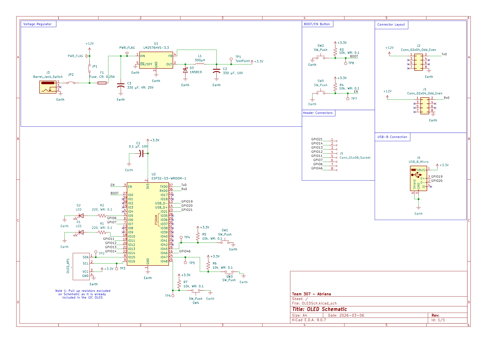

## Overview

This schematic is design to support the HMI Module of Team 307's Submersible Exploration Device. The goal of this module is to allow users to interact with the OLED by using push buttons to go through a series of menu options to recieve data or change the speed of the motor in three modes: Fast, slow, and stop. This satisfies the project's requirement of allowing users to interact with the product. The main chip used for this project is the ESP32 as it is able to support I2C which is needed for the project. 

{style width:"350" height:"300;"}
**Figure 1:** OLED schematic.

## Resouces

The schematic as a PDF download is available [*here*](OLEDSch.pdf), and the Zip folder of the project [*here*](OLEDSchematic.zip).
