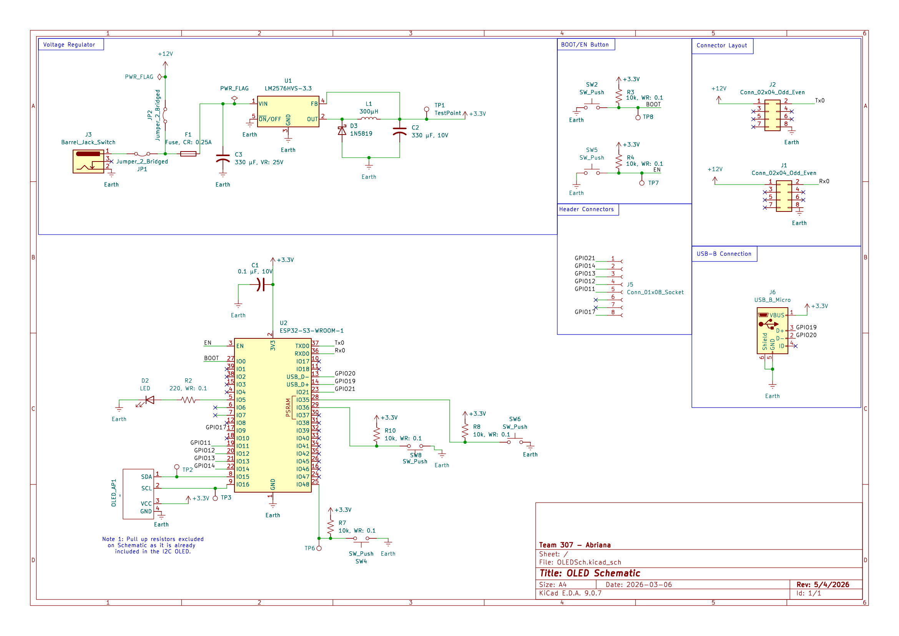

## Overview

This schematic is design to support the HMI Module of Team 307's Submersible Exploration Device. The goal of this module is to allow users to interact with the OLED by using a push button to allow the change of direction of either clockwise(0) or counter-clockwise(1) when pressed. Furthermore, the OLED then would display the distance it detects from the distance sensor.

**Figure 1:** OLED schematic.

## Resouces

The schematic as a PDF download is available [*here*](finalSchematicA.pdf), and the Zip folder of the project [*here*](FINAL_OLEDSch.zip).
