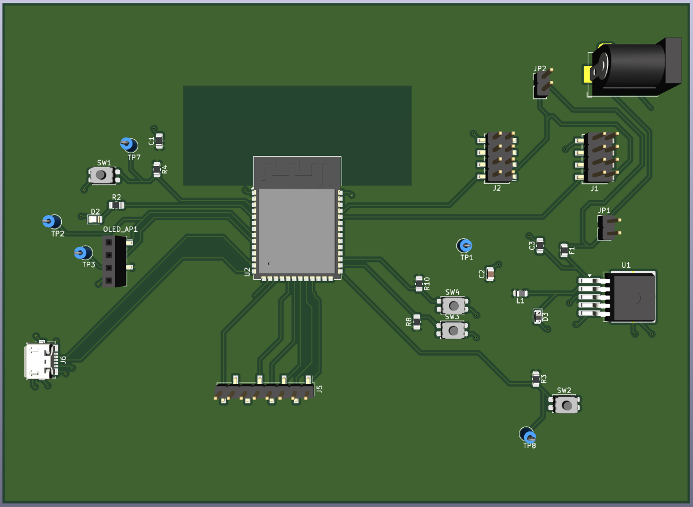
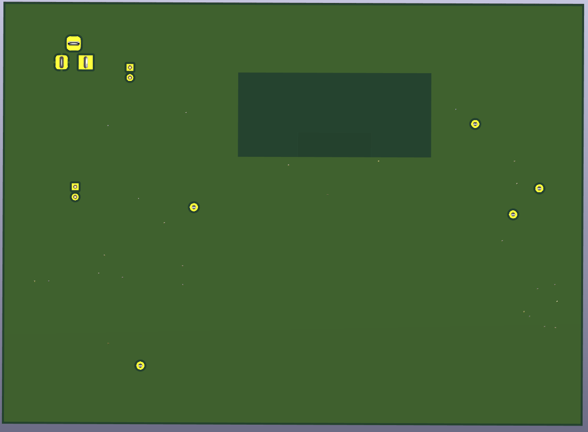
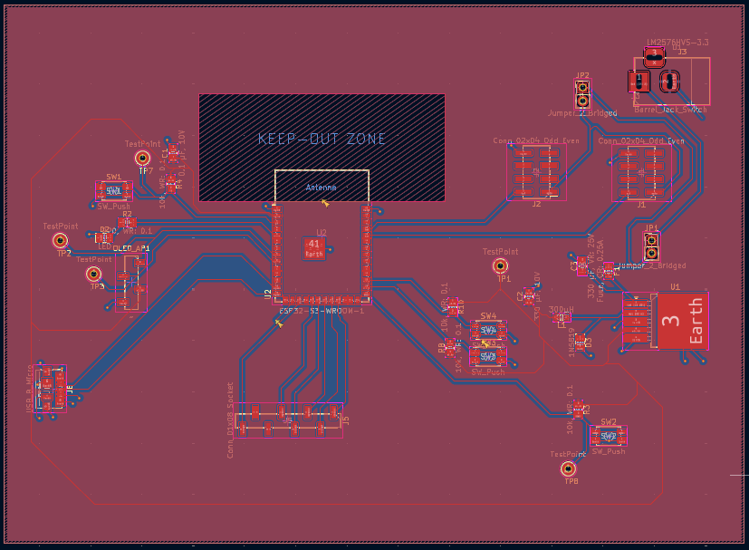
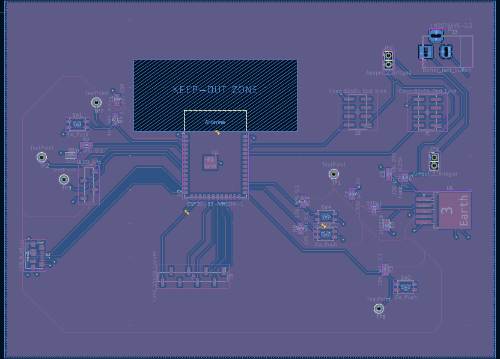

## Overview
This is the PCB Design of the OLED subsystem that uses the ESP32 mircocontroller. There is an 8-pin header on the upper right to allow communication between boards and same power and ground received from the daisy chain. Furthermore, the voltage regulator ensures 3.3V to the rest of the board to make sure that it doesn't blow up the major components. This is the updated PCB Design as the micro-usb port of the design is not linked to the power source, only the D+/D- to reflect the chnages I had to do for the hardware. There are a decent amount of test points and debuggers to make sure that when there is errors, there is somewhere to check. 

## PCB 3D Top

## PCB 3D Bottom

## PCB Whole View

## PCB Power Plane

## PCB Ground Plane

## Files
Here is the zip file of the whole project, including the gerber files located inside: [OLED Files](FINAL_OLEDSch.zip)
