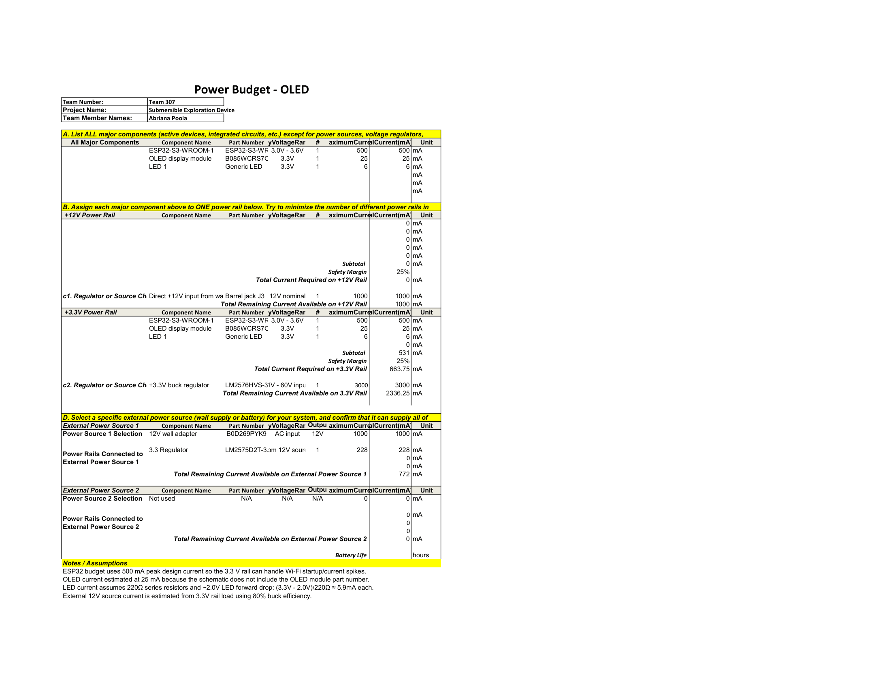

## Overview

The point of this power budget is to estimate the power required to operate the HMI Module based off the components selected from the [Component Selection page](https://apoolaz.github.io/apoola01.github.io/03-Component-Selection/Component-Selection/). Team 307 will be sharing a 12V of power which is displayed within the document while also showing which components would use the 3.3V and how much estimate current will be drawn. There is no battery used currently which is why that external power source 2 is left blank. 

{style width:"350" height:"300;"}

## Conclusions

From the prepared Power Budget, the HMI module can safely function as it meets the power requirements of each compinent. Based on the numbers, the 3.3V regulator can have a load between 537mA to 671mA (this is based off the 25% safety margin). This is proven to be operational based of the voltage regulator's datasheet. Thanks to that, all supporting components can safely operate. 

When testing the board, there was no concerning signs of errors thanks to the given power budget. All components were able to function safely as the board was able to give the appropriate power and current from the 3.3V and the power regulator was within the safety margins in the 12V rails.

## Resources

The power budget as a PDF download is available [*here*](FINALZPB.pdf), and a Microsoft Excel Sheet [*here*](FINALZPower_Budget_307.xlsx).
